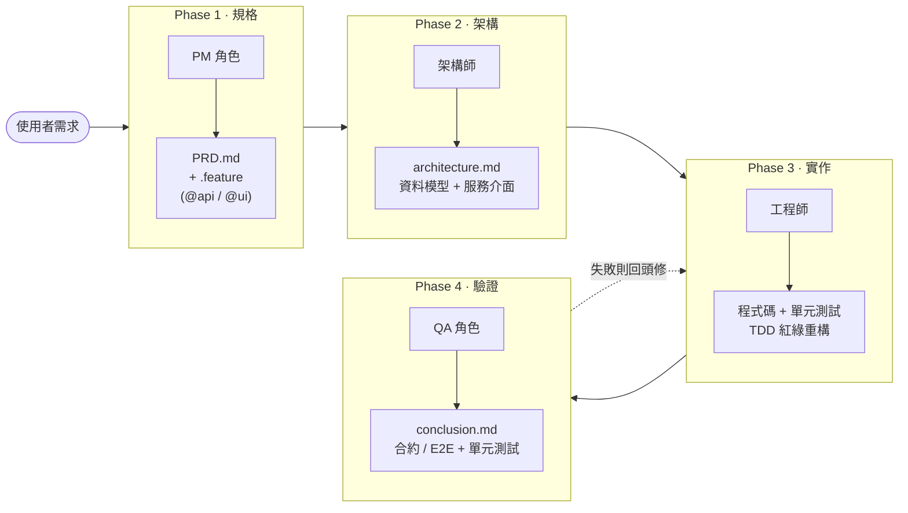
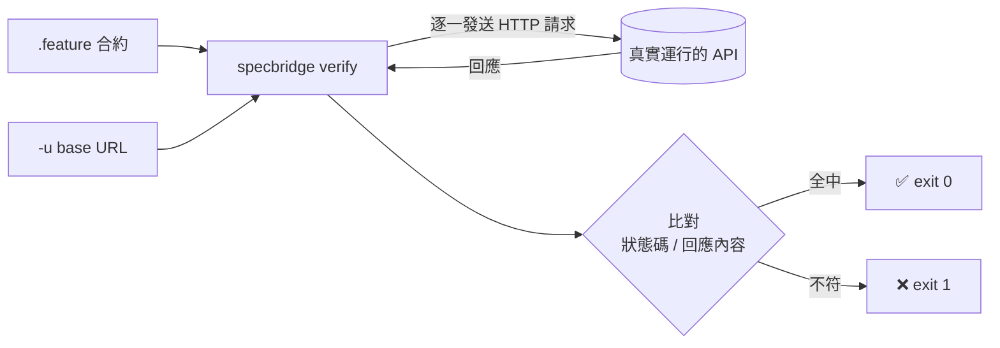
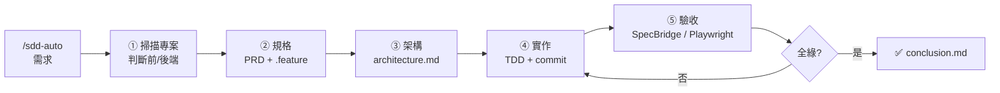

# GSI-Protocol

讓 AI 寫出「**對**」的程式碼

<div class="text-xl opacity-80 mt-4">
規格驅動開發（SDD）工作流程 — Gherkin · Structure · Implement
</div>

<div class="abs-br m-6 text-sm opacity-60">
James Hsueh · 2026.05
</div>

<!--
開場白：
今天要分享一個我自己在做的開源專案 GSI-Protocol。
它想解決一個我相信在座都遇過的問題：AI 很會寫程式，但它常常寫出「能跑、卻不是我要的」的東西。
這 30 分鐘，我會帶大家走過它的核心理念、四個階段，以及為什麼它能把「規格」變成「可執行的驗收」。
-->

---
layout: center
class: text-center
---

# 先問一個問題

<v-clicks>

<div class="text-3xl mt-8 leading-relaxed">
你讓 AI 寫了一個功能，<br/>
它跑起來了 —— <br/>
<span class="text-amber-400">但你怎麼知道它「對」？</span>
</div>

</v-clicks>

<!--
這是整場演講的核心提問。
讓觀眾停一下，回想自己 vibe coding 的經驗。
-->

---
layout: default
---

# AI 輔助開發的真實痛點

<div class="grid grid-cols-2 gap-6 mt-6">

<div v-click class="p-4 rounded-lg bg-red-500/10 border border-red-500/30">
<div class="text-2xl">🌀 規格在你腦中</div>
<p class="opacity-80 mt-2">需求只存在對話裡，AI 用猜的，你也說不清「驗收標準」是什麼。</p>
</div>

<div v-click class="p-4 rounded-lg bg-red-500/10 border border-red-500/30">
<div class="text-2xl">🏗️ 沒有架構就硬寫</div>
<p class="opacity-80 mt-2">AI 直接從一句話跳到程式碼，結構東拼西湊，難以維護。</p>
</div>

<div v-click class="p-4 rounded-lg bg-red-500/10 border border-red-500/30">
<div class="text-2xl">✅ 「能跑」≠「正確」</div>
<p class="opacity-80 mt-2">沒有客觀驗收，全靠人工肉眼檢查，邊界與錯誤情境常被漏掉。</p>
</div>

<div v-click class="p-4 rounded-lg bg-red-500/10 border border-red-500/30">
<div class="text-2xl">🔁 改一次、壞一片</div>
<p class="opacity-80 mt-2">需求變了，沒人知道哪些情境受影響，回歸測試無從談起。</p>
</div>

</div>

<div v-click class="mt-6 text-center text-xl">
問題不在 AI 不夠強，而在於 <span class="text-amber-400 font-bold">我們沒有給它一條可驗證的軌道</span>。
</div>

<!--
強調：這些痛點的共通點，是「缺乏一個從需求到驗收的結構化軌道」。
GSI-Protocol 就是要提供這條軌道。
-->

---
layout: center
class: text-center
---

# GSI = G · S · I

<div class="grid grid-cols-3 gap-8 mt-10">

<div v-click class="p-6 rounded-xl bg-blue-500/10 border border-blue-500/30">
<div class="text-6xl font-bold text-blue-400">G</div>
<div class="text-2xl mt-2">Gherkin</div>
<div class="opacity-70 mt-2">規格 · Specification</div>
<div class="text-sm opacity-60 mt-2">系統「該做什麼」</div>
</div>

<div v-click class="p-6 rounded-xl bg-green-500/10 border border-green-500/30">
<div class="text-6xl font-bold text-green-400">S</div>
<div class="text-2xl mt-2">Structure</div>
<div class="opacity-70 mt-2">架構 · Architecture</div>
<div class="text-sm opacity-60 mt-2">系統「該怎麼組織」</div>
</div>

<div v-click class="p-6 rounded-xl bg-purple-500/10 border border-purple-500/30">
<div class="text-6xl font-bold text-purple-400">I</div>
<div class="text-2xl mt-2">Implement</div>
<div class="opacity-70 mt-2">實作 · Implementation</div>
<div class="text-sm opacity-60 mt-2">把設計「變成程式碼」</div>
</div>

</div>

<div v-click class="mt-10 text-xl opacity-80">
一條從<b>需求</b>到<b>可投產程式碼</b>、全程可追溯的軌道
</div>

<!--
GSI 三個字母就是三個支柱，也是核心方法論。
規格先行、架構優先、實作驗證。
-->

---
layout: default
---

# 核心理念：規格驅動、架構優先

<div class="mt-4 text-lg leading-relaxed">

GSI-Protocol 不是又一個 AI 寫程式工具，而是一套 **工作流程方法論**：

</div>

<div class="grid grid-cols-2 gap-6 mt-6">

<div v-click>

### 它相信的事

- 先把**需求講清楚**（Gherkin），再談怎麼做
- 程式碼之前先有**架構**，且架構與語言無關
- 每一行程式碼都能**追溯**回某個業務情境
- 驗收應該是**客觀、可自動執行**的

</div>

<div v-click>

### 它怎麼做到

- 把開發拆成 **4 個角色階段**：PM → 架構師 → 工程師 → QA
- 每階段產出**明確文件**，下一階段以它為輸入
- 用 **Gherkin** 當共通語言串起全程
- 讓 Gherkin **直接變成可執行的驗收**

</div>

</div>

<div v-click class="mt-6 p-3 rounded-lg bg-amber-500/10 border border-amber-500/30 text-center">
一句話：<b>GSI ≈ BDD + 架構優先設計</b> —— 架構階段補上了 BDD 缺的那一塊。
</div>

<!--
這頁是把理念講透。重點是「方法論」而非「工具」。
最後那句 BDD + 架構優先，是它和傳統 BDD 的核心差異，後面會再對照。
-->

---
layout: center
---

# 四階段工作流程



<div class="text-center mt-4 opacity-80">
每個階段 = 一個角色 + 一份明確的輸入與產出
</div>

<!--
這是全場的骨架圖。
強調：四個階段對應四種角色，職責分離；前一階段的產出是後一階段的輸入。
最後 Phase 4 失敗會回到 Phase 3，形成迭代閉環。
-->

---
layout: section
---

# Phase 1 — Gherkin

規格（PM 角色）· `/sdd-spec`

---
layout: default
---

# Phase 1：把需求翻譯成「規格」

<div class="grid grid-cols-2 gap-6">

<div>

**角色**：產品經理（PM）
**輸入**：一句自然語言需求
**產出**：

- 📄 `PRD.md` — 業務行為規格（給人讀）
- 📐 `{feature}.feature` — Gherkin 合約（給機器執行）

<div v-click class="mt-4 p-3 rounded-lg bg-blue-500/10 border border-blue-500/30">

**PM 的紀律**：只談「系統該做什麼」，
不碰資料庫、不碰程式碼、不碰技術細節。

</div>

</div>

<div v-click>

**開工前會先做三件事**

1. 🔍 掃描專案結構與技術棧
2. 📚 讀過所有既有的 `.gsi` 規格，避免衝突
3. 🧭 判斷專案類型（前端 / 後端 / 全端）

<div class="mt-3 text-sm opacity-70">
專案類型決定「驗收角度」：<br/>
後端 → <code>@api</code>、前端 → <code>@ui</code>、全端 → 兩者皆產
</div>

</div>

</div>

<!--
重點一：PM 角色約束，只談 What，這逼迫需求被講清楚。
重點二：它不是直接生成，而是先掃描專案、讀既有規格、判斷類型，做出「專案感知」的規格。
-->

---
layout: default
---

# Gherkin：人與機器都讀得懂的規格

<div class="grid grid-cols-2 gap-4 text-sm">

<div>

**後端 `@api`**（後端 API 合約）

```gherkin
@api
Feature: 使用者登入

  Scenario: 登入成功
    When I send a "POST" request to "/login"
    And the request body is:
      """
      { "email": "a@b.com", "password": "p@ss" }
      """
    Then the response status should be 200
    Then the response body should contain
      field "token" with value "..."
```

</div>

<div>

**前端 `@ui`**（對應 Playwright E2E）

```gherkin
@ui
Feature: 使用者登入

  Scenario: 登入成功
    Given I am on the "login" page
    When I fill in "email" with "a@b.com"
    And I click the "登入" button
    Then I should see "歡迎回來"
    And I should be navigated to "dashboard"
```

</div>

</div>

<div v-click class="mt-4 p-3 rounded-lg bg-green-500/10 border border-green-500/30 text-center">
<b>Given-When-Then</b>：前置條件 → 動作 → 預期結果。<br/>
同一份規格，下游能<b>直接拿去驗收</b> —— 這是 GSI 的關鍵伏筆。
</div>

<!--
左右對照讓觀眾看到同一個「登入」在 @api 和 @ui 下的不同寫法。
強調：Gherkin 用受限的步驟詞彙，所以它不只是文件，是「可執行」的合約。
這裡先埋伏筆，Phase 4 會揭曉怎麼執行。
-->

---
layout: section
---

# Phase 2 — Structure

架構（架構師角色）· `/sdd-arch`

---
layout: default
---

# Phase 2：從規格長出「架構」

<div class="text-lg mb-4">輸入 Gherkin，產出 <code>architecture.md</code> —— <b>與程式語言無關</b>的高階設計。</div>

<div class="grid grid-cols-2 gap-6">

<div v-click class="p-4 rounded-lg bg-green-500/10 border border-green-500/30">

### 名詞 → 資料模型

> User、Session token、Credentials …

成為 `User`、`SessionToken` 等實體，
含欄位、型別、列舉值。

</div>

<div v-click class="p-4 rounded-lg bg-green-500/10 border border-green-500/30">

### 動詞 → 服務介面

> 「submits login」、「generates token」…

成為 `AuthService.login()`、
`TokenService.generate()` 等方法簽章。

</div>

</div>

<div v-click class="mt-6">

**它的紀律**

- 🌐 **語言無關**：描述介面而非實作，TypeScript / Python / Go 都能落地
- 🧭 **專案感知**：沿用既有目錄結構與命名慣例
- 🔗 **可追溯**：每個模型 / 方法都標註來源 Gherkin 行號

</div>

<!--
這是 GSI 相對 BDD 最獨特的一塊。
核心技巧：名詞變模型、動詞變服務介面 —— 一個很直覺的轉換法則。
強調語言無關 + 可追溯（標行號），讓架構可被 review。
-->

---
layout: default
---

# 架構文件長什麼樣

<div class="text-sm">

```markdown
# 使用者登入 - Architecture Design
> Source: .gsi/login/login.feature

## 1. Project Context
- 語言: TypeScript · 框架: Express · 模式: Controller→Service→Repository

## 3. Data Models
### User   ← 來源: "registered user" (line 5)
| 欄位 | 型別 | 必填 | 說明 |
|------|------|------|------|
| email | string | ✅ | 唯一、需驗證 |
| passwordHash | string | ✅ | bcrypt |

## 4. Service Interfaces
### AuthService.login(email, password) → SessionToken   ← (line 10-14)
  業務規則: 1. 驗證憑證  2. 簽發 token  3. 處理錯誤

## 6. Scenario Mapping
| 情境 | 行號 | 資料模型 | 服務方法 |
| 登入成功 | 10-14 | User, SessionToken | login() |
```

</div>

<div v-click class="mt-2 p-2 rounded-lg bg-amber-500/10 border border-amber-500/30 text-center text-sm">
「情境對應表」把每個 Gherkin Scenario 綁定到模型與方法 —— <b>需求變更時，影響範圍一目了然</b>。
</div>

<!--
不用逐行念，帶過重點：Context、Data Models、Service Interfaces、Scenario Mapping。
最有價值的是 Scenario Mapping 那張表，這就是「可追溯性」的具體展現。
-->

---
layout: section
---

# Phase 3 — Implement

實作（工程師角色）· `/sdd-impl`

---
layout: default
---

# Phase 3：以 TDD 把架構變成程式碼

<div class="grid grid-cols-3 gap-4 mt-4">

<div v-click class="p-4 rounded-lg bg-red-500/10 border border-red-500/30 text-center">
<div class="text-3xl">🔴 Red</div>
<p class="mt-2 opacity-80">先寫測試，確認它<b>失敗</b>。功能還沒實作。</p>
</div>

<div v-click class="p-4 rounded-lg bg-green-500/10 border border-green-500/30 text-center">
<div class="text-3xl">🟢 Green</div>
<p class="mt-2 opacity-80">寫<b>剛好夠用</b>的程式碼讓測試通過，不過度設計。</p>
</div>

<div v-click class="p-4 rounded-lg bg-blue-500/10 border border-blue-500/30 text-center">
<div class="text-3xl">🔵 Refactor</div>
<p class="mt-2 opacity-80">重構，並確保<b>先前綠燈</b>都還是綠的。</p>
</div>

</div>

<div v-click class="mt-6">

### 嚴格遵循架構

- 資料模型、方法簽章 **必須與 `architecture.md` 完全一致**
- 依驗收角度決定測試策略：
  - `@api` → 寫單元測試驅動實作（合約交給 Phase 4）
  - `@ui` → 不手寫測試，建立一次性 Playwright 腳手架即可

</div>

<div v-click class="mt-4 p-3 rounded-lg bg-purple-500/10 border border-purple-500/30 text-center">
🔖 <b>每完成一個 TDD 循環就 commit 一次</b>，訊息以 <code>feat:</code> 開頭 —— 提交粒度對齊業務情境。
</div>

<!--
TDD 三步驟大家熟。重點在 GSI 的兩個特色：
1. 程式碼嚴格對齊架構（簽章一致）。
2. 依 @api/@ui 走不同測試策略。
3. 每個 cycle 一個 commit，feat: 開頭 —— 這讓 git 歷史本身就是業務情境的紀錄。
-->

---
layout: section
---

# 進 Phase 4 之前

先認識一個工具：**SpecBridge**

<div class="text-lg opacity-70 mt-2">讓 <code>@api</code> 規格「真的被執行」的合約測試 CLI</div>

<!--
過場：Phase 1 我們寫了 @api 的 Gherkin 合約，但它怎麼變成「驗收」？
Phase 4 驗收後端，背後靠的就是我自己寫的這個小工具 SpecBridge。
先花兩三張投影片把它講清楚，等下 Phase 4 就會用到。
-->

---
layout: default
---

# SpecBridge 是什麼？

<div class="text-lg mb-4">一個我自己寫的開源 CLI 工具（<code>@ksz54213/specbridge</code>，MIT），做的事是 <b>合約測試（Contract Testing）</b>。</div>

<div class="grid grid-cols-2 gap-6">

<div v-click class="p-4 rounded-lg bg-blue-500/10 border border-blue-500/30">

### 核心概念

把一份 Gherkin `.feature` 當成「API 合約」，
對著一個**真實運行的 HTTP 服務**逐一發送請求，
再斷言它的**狀態碼**與**回應內容**。

</div>

<div v-click class="p-4 rounded-lg bg-blue-500/10 border border-blue-500/30">

### 一句話

你用白話寫下「這支 API 該怎麼回應」，
SpecBridge 幫你<b>自動打 API、驗證它真的這樣回</b>。

</div>

</div>

<div v-click class="mt-6 p-3 rounded-lg bg-amber-500/10 border border-amber-500/30">
🔑 <b>和傳統 BDD 的差別</b>：Cucumber 每個步驟都要自己寫膠水程式（step definitions）。
SpecBridge 內建一組固定的 HTTP 步驟詞彙 —— <b>零膠水程式碼</b>，寫完 <code>.feature</code> 就能直接驗。
</div>

<!--
重點三件事：
1. 這是我自己的開源工具，已發佈到 npm。
2. 它做「合約測試」：拿 Gherkin 去打真實 API。
3. 最大賣點：不用像 Cucumber 那樣手寫 step definitions，零膠水程式碼。
-->

---
layout: default
---

# SpecBridge 怎麼運作



<div class="grid grid-cols-2 gap-4 mt-2 text-xs">

<div v-click>

```bash
specbridge verify -f login.feature \
  -u http://localhost:3000 \
  -H "Authorization: Bearer <token>"
```

每個 **Scenario = 一次 API 呼叫 + 一組斷言**

</div>

<div v-click>

| 步驟 | 作用 |
|------|------|
| `When I send a "METHOD" request to "/path"` | 發送請求 |
| `And the request body is:` + JSON | 帶請求 body |
| `Then the response status should be 200` | 斷言狀態碼 |
| `… body should be:` / `contain field "k"` | 比對回應 |

</div>

</div>

<!--
左邊：指令長相，-f 合約、-u 服務網址、-H 可重複帶 header。
右邊：支援的固定步驟詞彙 —— 這就是 Phase 1 @api Gherkin 用的那組詞彙，前後呼應。
強調 exit code 0/1。
-->

---
layout: default
---

# 範例與輸出

<div class="grid grid-cols-2 gap-4 text-sm">

<div>

**合約 `example.feature`**

```gherkin
Feature: API Contract

  Scenario: 健康檢查
    When I send a "GET" request
      to "/api/health"
    Then the response status should be 200
    Then the response body should contain
      field "status" with value "ok"

  Scenario: 建立使用者
    When I send a "POST" request to "/api/users"
    And the request body is:
      """
      { "name": "Alice" }
      """
    Then the response status should be 201
```

</div>

<div>

**執行結果**

```text
✅  Scenario: 健康檢查
    GET http://localhost:3000/api/health
✅  Scenario: 建立使用者
    POST http://localhost:3000/api/users
────────────────────────────────
  Results: 2 passed, 0 failed
────────────────────────────────
```

<div v-click class="mt-3 p-2 rounded-lg bg-green-500/10 border border-green-500/30">
Exit code <b>0</b> 全過 / <b>1</b> 有失敗 → 直接接進 <b>CI/CD</b>。
</div>

</div>

</div>

<div v-click class="mt-4 p-3 rounded-lg bg-purple-500/10 border border-purple-500/30 text-center">
在 GSI 裡，Phase 4 的 <code>/sdd-verify</code> 對 <code>@api</code> 功能做的，就是<b>呼叫 SpecBridge</b> 來驗收。
</div>

<!--
左右對照：合約 → 輸出。每個 Scenario 一行 ✅/❌，最後總結。
收束到 GSI：Phase 4 驗收後端 = 跑 SpecBridge。下一張就正式進 Phase 4。
-->

---
layout: section
---

# Phase 4 — Verify

驗證（QA 角色）· `/sdd-verify`

---
layout: default
---

# Phase 4：客觀、自動化的驗收

<div class="text-lg mb-3">QA 角色：<b>只驗收、不修改</b>。依 Gherkin 的 tag 自動路由驗收方式。</div>

<div class="grid grid-cols-2 gap-6">

<div v-click class="p-4 rounded-lg bg-blue-500/10 border border-blue-500/30">

### `@api` → SpecBridge

把 `.feature` 當合約，對著**真實 HTTP 服務**驗證：

```bash
specbridge verify \
  -f .gsi/login/login.feature \
  -u http://localhost:3000
```

逐一記錄每個 Scenario 的 pass / fail。

</div>

<div v-click class="p-4 rounded-lg bg-purple-500/10 border border-purple-500/30">

### `@ui` → Playwright + playwright-bdd

`.feature` 編譯成 Playwright 測試直接跑：

```bash
npx bddgen && npx playwright test
```

`webServer` 自動起前端，Scenario 名稱直接對應測試報告。

</div>

</div>

<div v-click class="mt-5">

加上 **單元測試** 與 **架構符合度檢查**，三者全綠 → 產出 `conclusion.md`；
任一失敗 → **不產報告**，直接回報錯誤，退回 Phase 3 修正再驗。

</div>

<!--
這頁是 GSI 的高潮：規格真的「執行」起來了。
@api 用 SpecBridge 打真實 API；@ui 用 playwright-bdd 把 Gherkin 編譯成 E2E。
強調閉環：失敗就退回 Phase 3，直到全綠。
-->

---
layout: center
class: text-center
---

# 關鍵創新：讓 Gherkin「可執行」

<div class="grid grid-cols-2 gap-8 mt-8">

<div v-click class="p-6 rounded-xl bg-blue-500/10 border border-blue-500/30">
<div class="text-2xl font-bold text-blue-400">SpecBridge</div>
<div class="opacity-80 mt-2">後端合約測試 CLI</div>
<div class="text-sm opacity-60 mt-3">
把 <code>@api</code> Gherkin 直接拿去打真實 API，<br/>驗證回應狀態與內容。
</div>
</div>

<div v-click class="p-6 rounded-xl bg-purple-500/10 border border-purple-500/30">
<div class="text-2xl font-bold text-purple-400">playwright-bdd</div>
<div class="opacity-80 mt-2">前端 E2E 編譯器</div>
<div class="text-sm opacity-60 mt-3">
把 <code>@ui</code> Gherkin 編譯成 Playwright 測試，<br/>不必為每個情境手寫測試碼。
</div>
</div>

</div>

<div v-click class="mt-8 text-xl">
規格不再是「寫完就過期的文件」，<br/>
而是 <span class="text-amber-400 font-bold">會被執行、會把關的活合約</span>。
</div>

<!--
這頁把 Phase 1 埋的伏筆收掉。
傳統 BDD 規格常常寫完就跟程式碼脫節；GSI 透過這兩個工具讓規格「持續可執行」，這是最大的價值主張。
-->

---
layout: default
---

# 安裝與使用

<div class="grid grid-cols-2 gap-6 text-sm">

<div v-click>

### 一行安裝

```bash
uvx --from gsi-protocol-installer gsi-install
```

安裝器引導你選 **AI 平台 → 全域/專案 → 裝好指令**。

<div class="mt-3">

**多平台支援**（同一份模板自動轉換格式）

| 平台 | 用法 |
|------|------|
| Claude Code / Codex | `/sdd-auto <需求>` |
| GitHub Copilot | `@workspace /sdd-auto` |

</div>

</div>

<div v-click>

### 可用指令

| 指令 | 作用 | 階段 |
|------|------|------|
| `/sdd-auto` | 一鍵跑完整流程 | 全部 |
| `/sdd-spec` | 產生 PRD + Gherkin 合約 | 1 |
| `/sdd-arch` | 從規格設計架構 | 2 |
| `/sdd-impl` | TDD 實作程式碼 | 3 |
| `/sdd-verify` | 合約 / E2E + 單元測試驗收 | 4 |

</div>

</div>

<!--
講安裝：強調「一行裝完、跨三個平台」。
背後的巧思：模板用佔位符，安裝器針對不同平台做格式轉換。
指令表給觀眾一個操作的全貌。手動逐步 vs 一鍵 /sdd-auto 都行。
-->

---
layout: default
---

# 實際跑一次（自動模式）

<div class="text-center my-2">

```bash
/sdd-auto 為產品列表 API 加上分頁功能
```

</div>



<div v-click class="mt-2 text-center text-sm opacity-80">
全程<b>專案感知</b>：自動偵測 <code>package.json</code> / <code>go.mod</code> / <code>requirements.txt</code>，沿用你的結構與慣例。
</div>

<!--
這頁可以搭配真實 demo（如果現場有環境）。
若無法 demo，就用這張流程圖口頭走一遍，讓觀眾看到「一句話進、可驗收的功能出」。
-->

---
layout: default
---

# GSI vs 傳統開發 vs BDD

<div class="text-sm mt-4">

| 面向 | 傳統開發 | BDD | **GSI-Protocol** |
|------|----------|-----|------------------|
| 需求 | 常常模糊、變動 | Gherkin 情境 | ✅ Gherkin 情境 |
| 架構 | 常被略過 | 不強調 | ✅ **核心支柱（S）** |
| 實作 | 直接照需求寫 | 測試驅動 | ✅ 架構驅動 + TDD |
| 驗收 | 人工測試 | 需手寫 step 程式 | ✅ **規格直接可執行** |
| 文件 | 事後補（如果有） | 與程式易脫節 | ✅ 開發中自動產生、持續可執行 |
| 可追溯 | 弱 | 中 | ✅ 程式 ↔ 行號 ↔ 情境 |

</div>

<div v-click class="mt-6 p-3 rounded-lg bg-amber-500/10 border border-amber-500/30 text-center">
GSI 的差異化：<b>補上架構這一層</b> + <b>讓 Gherkin 真的被執行</b>。
</div>

<!--
這張對照表幫觀眾定位 GSI 在方法論光譜上的位置。
相對 BDD 的兩個關鍵增量：架構支柱、規格可執行（不必手寫 step 膠水程式）。
-->

---
layout: center
class: text-center
---

# 它帶來什麼

<div class="grid grid-cols-2 gap-6 mt-6 text-left">

<div v-click class="p-4 rounded-lg bg-green-500/10 border border-green-500/30">
<b>🎯 清晰</b><br/>
<span class="opacity-80">需求、設計、程式碼三層分離，各司其職。</span>
</div>

<div v-click class="p-4 rounded-lg bg-green-500/10 border border-green-500/30">
<b>🔗 可追溯</b><br/>
<span class="opacity-80">每行程式碼都能回溯到一個業務情境。</span>
</div>

<div v-click class="p-4 rounded-lg bg-green-500/10 border border-green-500/30">
<b>✅ 可驗收</b><br/>
<span class="opacity-80">驗收客觀、自動、可進 CI/CD。</span>
</div>

<div v-click class="p-4 rounded-lg bg-green-500/10 border border-green-500/30">
<b>🌐 語言無關</b><br/>
<span class="opacity-80">同一份規格與架構，任何技術棧都能落地。</span>
</div>

<div v-click class="p-4 rounded-lg bg-green-500/10 border border-green-500/30">
<b>👥 協作友善</b><br/>
<span class="opacity-80">PM / 架構師 / 工程師 / QA 角色清楚分工。</span>
</div>

<div v-click class="p-4 rounded-lg bg-green-500/10 border border-green-500/30">
<b>🤖 馴服 AI</b><br/>
<span class="opacity-80">給 AI 一條可驗證的軌道，而非放任它猜。</span>
</div>

</div>

<!--
總結效益。最後一點呼應開場：GSI 的本質是「給 AI 一條軌道」。
-->

---
layout: center
class: text-center
---

# 回到最初的問題

<v-clicks>

<div class="text-2xl mt-6 opacity-80">
你讓 AI 寫了一個功能，它跑起來了 ——<br/>你怎麼知道它「對」？
</div>

<div class="text-3xl mt-10 leading-relaxed">
因為它<br/>
<span class="text-blue-400">通過了你寫清楚的規格（G）</span>、<br/>
<span class="text-green-400">遵循了你設計的架構（S）</span>、<br/>
<span class="text-purple-400">被規格本身自動驗收（I）</span>。
</div>

</v-clicks>

<!--
首尾呼應，把開場的提問用 G-S-I 三個字母回答掉。這是整場的情緒高點。
-->

---
layout: center
class: text-center
---

# 謝謝聆聽 🙌

<div class="text-xl mt-4 opacity-80">GSI-Protocol — Spec-Driven Development for AI</div>

<div class="mt-8 grid grid-cols-1 gap-2 text-lg">

🔗 GitHub：`github.com/CodeMachine0121/GSI-Protocol`

📦 安裝：`uvx --from gsi-protocol-installer gsi-install`

🌐 Landing：`coding-afternoon.com/gsi-protocol`

</div>

<div class="mt-10 text-2xl">
Q & A
</div>

<div class="abs-br m-6 text-sm opacity-60">
James Hsueh · asdfg55887@gmail.com
</div>

<!--
收尾：給連結、安裝指令、landing page。留時間 Q&A。
-->
